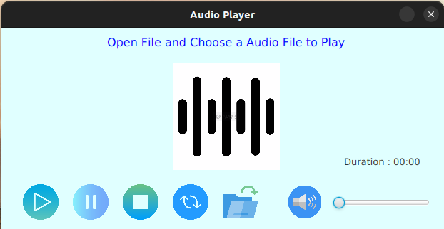

# Simple-Audio-Player

This is a simple audio player built using Java and JavaFX. The application allows you to play audio files in various formats and provides basic playback controls.



## Features

- Play audio files in formats such as MP3, WAV, FLAC, etc.
- Pause, resume, and stop playback.
- Adjust the volume.
- Display the current playback time and duration.

## Prerequisites

- Java Development Kit (JDK) 8 or above
- JavaFX SDK (included in JDK 8, separate installation required for JDK 11 and above)

## Getting Started

Clone the repository:

   ```shell
   git clone https://github.com/RH-JavaFX-Projects/Simple-Audio-Player.git

